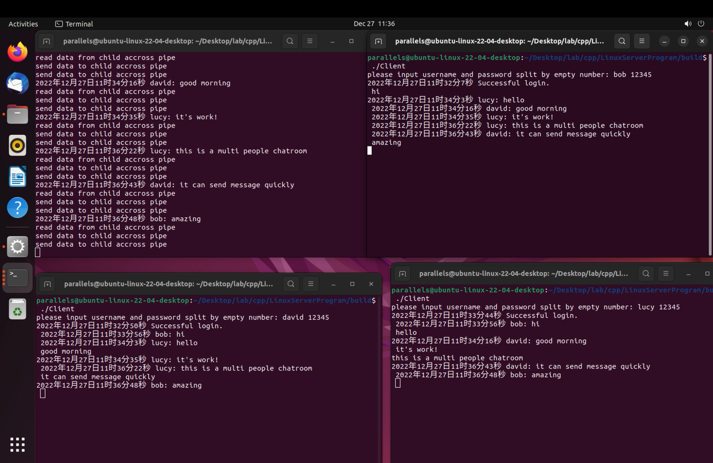
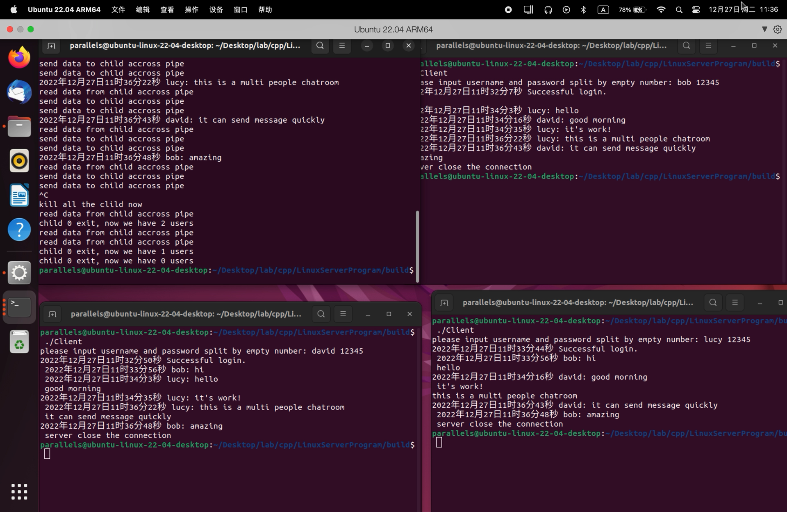

# 项目描述

实现了不同网段下的多个用户在 Linux 终端上的聊天信息发送与接收。启动程序后，用户首先输入各 自的帐号和密码，若和服务端匹配，则进入公共聊天室，否则退出。进入聊天室后，用户发出的信息会经由服务 端转发给其他在线的所有用户，用户也会接收其他用户发出的所有信息，类似于 QQ 群或微信群的聊天方式。

服务端采用类似于单 Reactor 多进程的实现方式。主进程采用 epoll 监听事件，每有一个新的客户端连接到来时，就为其新开一个子进程，并在该子进程中完成用户的登录验证和聊天信息的发送与接收。子进程和父进程采用管道通信，子进程之间的信息传输采用共享内存的方式。

子进程和父进程都采用epoll的方式处理事件（事件包括新的客户端连接到来、因为异常产生的信号、子进程和父进程之间的通信）；
为防止数据的频繁拷贝，采用共享内存存储数据，即为每一个子进程按连接顺序划分一块固定大小的共享内存，当某一个客户端发送消息时，服务端与该客户端绑定的子进程会从epoll的事件队列中收到该事件，
并发送该子进程的顺序号给父进程，父进程收到该消息后，再通知其余子进程在这一个序号上绑定的共享内存有消息可读，便完成了数据向其余客户端发送的功能。

整个项目的编译通过Cmake。

写了一个简单的shell脚本帮助测试。

# 如何使用
在该项目目录的命令行终端下运行如下两句：
```bash
chmod u+x script.sh
./script.sh
cd build
./Server
```
再新开一个终端：
```bash
./Client
```
结果如下：

会实时地显示发送消息的时间和用户
退出服务端或者客户端通过在对应命令行输入Ctrl+C即可，如下：


此外，
在passwd.txt中存储有客户的账号和密码，可以在这里新增或修改用户的信息；
在server.cpp和client.cpp的main函数可以更改服务端的ip地址和端口号。


# 遇到的问题
## Segmentation fault (core dumped)
编译可以通过，分段错误，此时程序崩溃，由数组下标越界引起。
## 文件不存在
使用如下程序查看当前程序工作的路径，多半是文件的目录路径没对应上。
```c++
char *buffer;
if ((buffer = getcwd(nullptr, 0)) == nullptr) {
    perror("getcwd error"); 
} else {     
    printf("%s\n", buffer); 
}
```
## goto注意事项
在goto和跳转的语句之间，不能含有任何变量的定义
```c++
// 错误的写法
goto label;
int a[5];
label:
cout<<"error"<<endl;
```
```c++
int a[5]; // 要拿出来才行
goto label;
label:
cout<<"right"<<endl;
```
## 父进程中使用new开辟出来的内存与子进程中的是相互独立的
不要妄图通过这种方式完成进程之间的通信，这也就意味着全局变量什么的，在父子进程之间都是相互独立的，进程之间传递消息只有那几种方式！！！
另外，程序打印的都是虚拟内存的地址

# 接下来的工作
* 将用户的数据使用MySQL数据库来管理；
* 将客户端做成网页；
* 将服务端的工作逻辑改为线程池加任务队列的方式。
* 写一个更完善的脚本帮助自动化的测试。
